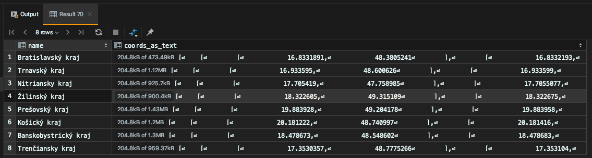
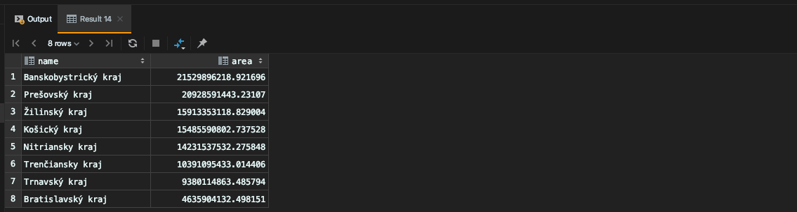
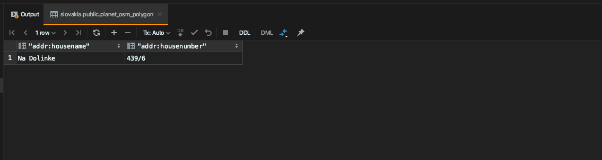
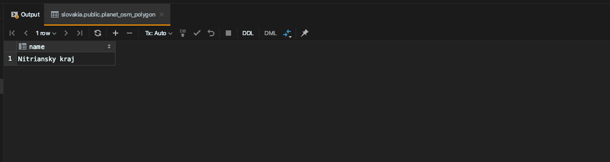
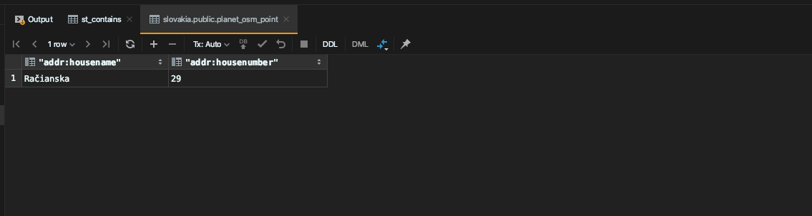
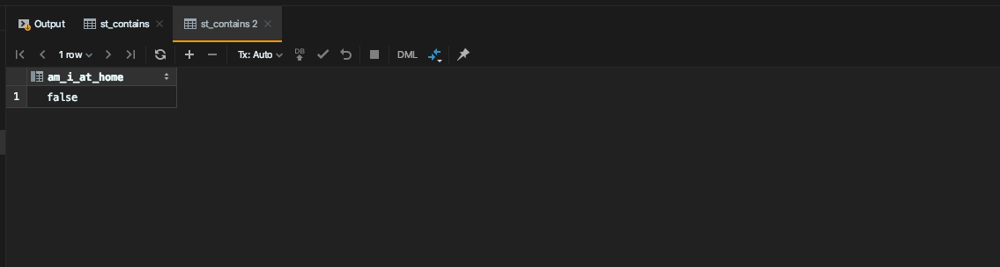
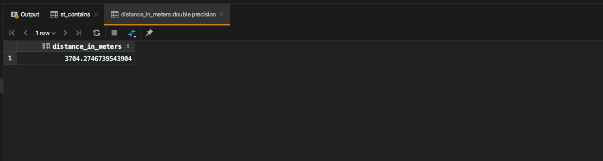

# Zadanie: Postgis 1

**Timotej Zaťko**

## Zadanie

1. stiahnite a importujte si dataset pre Open Street mapy z
http://download.freemap.sk/slovakia.osm/slovakia.osm.pbf do novej DB
2. zistite aké kraje sú na Slovensku (planet_osm_polygon, admin_level = ‘4’) a vypíšte
ich súradnice ako text
3. zoraďte kraje podľa ich veľkosti (st_area)
4. pridajte si dom, kde bývate ako polygón (nájdite si súradnice napr. cez google maps)
do planet_osm_polygon (pozor na súradnicový systém).
5. zistite v akom kraji je váš dom
6. pridajte si do planet_osm_point vašu aktuálnu polohu (pozor na súradnicový systém)
7. zistite ci ste doma - či je vaša poloha v rámci vášho bývania
8. zistite ako ďaleko sa nachádzate od FIIT (name = &#39;Fakulta informatiky a informačných
technológií STU&#39;)
9. Stiahnite si QGIS a vyplotujte kraje a váš dom z úlohy 2 na mape - napr. červenou
čiarou.

## Odpovede

### 1. stiahnite a importujte si dataset pre Open Street mapy z http://download.freemap.sk/slovakia.osm/slovakia.osm.pbf do novej DB

Hotovo.

### 2. zistite aké kraje sú na Slovensku (planet_osm_polygon, admin_level = ‘4’) a vypíšte ich súradnice ako text

Query:
```postgresql
select name, jsonb_pretty((st_asgeojson(st_transform(way, 4326)) :: json->'coordinates') :: jsonb) AS coords_as_text
    from planet_osm_polygon where admin_level='4';
``` 

Result:


### 3. zoraďte kraje podľa ich veľkosti (st_area)

Query:
```postgresql
select name, st_area(way) as area
    from planet_osm_polygon 
    where admin_level='4'
    order by area desc
```

Result:


### 4. pridajte si dom, kde bývate ako polygón (nájdite si súradnice napr. cez google maps) do planet_osm_polygon (pozor na súradnicový systém).

Query:
```postgresql
INSERT INTO planet_osm_polygon ("addr:housename", "addr:housenumber", way) VALUES (
  'Na Dolinke',
  '439/6',
  st_transform(st_polygonfromtext('POLYGON((18.414200 48.355131, 18.414322 48.355120, 18.414279 48.354938, 18.414284 48.354949, 18.414150 48.354970, 18.414200 48.355131))', 4326), 3857)
);
```

Vypíšeme si pridaný záznam.

Query:
```postgresql
SELECT "addr:housename", "addr:housenumber" FROM planet_osm_polygon WHERE "addr:housename"='Na Dolinke';
```

Result:



### 5. zistite v akom kraji je váš dom

Query:
```postgresql
select name from planet_osm_polygon where admin_level='4' and
    st_intersects(
        st_geomfromwkb(way),
        st_geomfromwkb((select way from planet_osm_polygon 
            where "addr:housename" = 'na dolinke' and "addr:housenumber" = '439/6')))
```

Result:


Áno, bývam v Nitrianskom kraji :)

### 6. pridajte si do planet_osm_point vašu aktuálnu polohu (pozor na súradnicový systém)

Query:
```postgresql
insert into planet_osm_point ("addr:housename", "addr:housenumber", way) VALUES (
    'Račianska',
    '29',
    st_transform(st_pointfromtext('POINT(17.1210526 48.1615504)', 4326), 3857)
);
```

Vypíšeme si pridaný záznam.

Query:
```postgresql
select "addr:housename", "addr:housenumber" from planet_osm_point where "addr:housename"='Račianska' and  "addr:housenumber"='29';
```

Result:


### 7. zistite ci ste doma - či je vaša poloha v rámci vášho bývania

Query:
```postgresql
select * from st_contains(
    (
        select way from planet_osm_polygon
            where "addr:housename"='Na Dolinke' and "addr:housenumber"='439/6'
    ),
    (
        select way from planet_osm_point
            where "addr:housename"='Račianska' and "addr:housenumber"='29'
    )
) am_i_at_home;
```

Result:


### 8. zistite ako ďaleko sa nachádzate od FIIT (name = &#39;Fakulta informatiky a informačných technológií STU&#39;)

Result:
```postgresql
select (st_distance(
   (
       select way from planet_osm_polygon
       where name = 'Fakulta informatiky a informačných technológií STU'
   ),
   (
       select way from planet_osm_point
       where "addr:housename"='Račianska' and "addr:housenumber"='29'
   )
) * cosd(
   (
       select st_y(st_transform(way,4326)) from planet_osm_point
       where "addr:housename"='Račianska' and "addr:housenumber"='29'
   )
)) as distance_in_meters;
```

Result:


### 9. Stiahnite si QGIS a vyplotujte kraje a váš dom z úlohy 2 na mape - napr. červenou čiarou.
