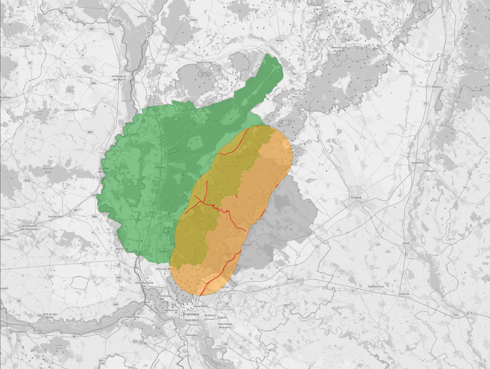
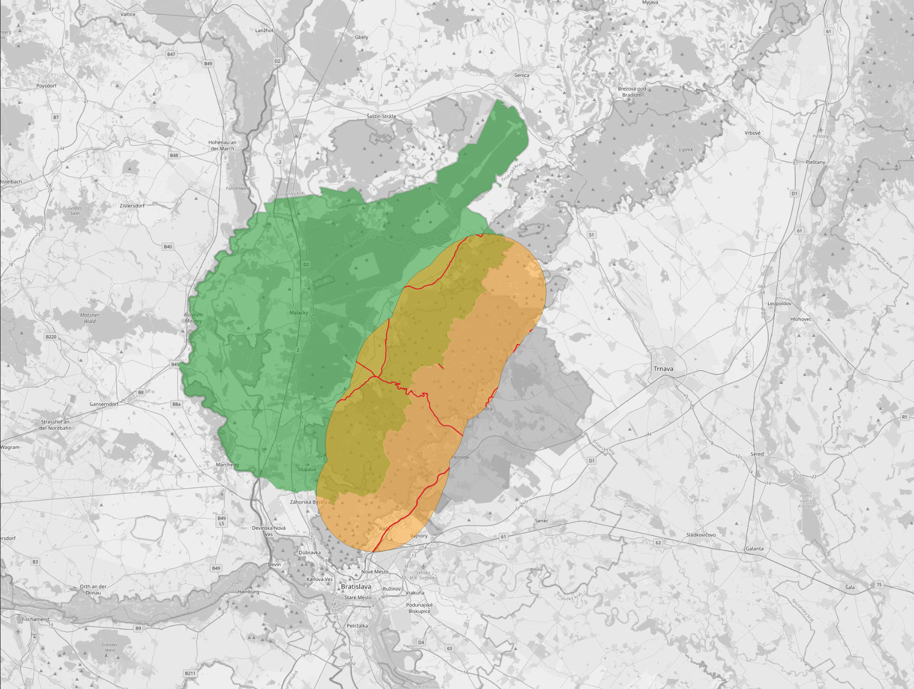

# 5. Zadanie: PostGIS - 2

**Timotej Zaťko**

## Zadanie

1. Zistite súradnice centroidu (ťažiska) plošne najmenšieho okresu (vo výsledku nezabudnite uviesť aj EPSG kód súradnicového systému).
2. Vytvorte priestorovú tabuľku všetkých úsekov ciest, ktorých vzdialenosť od vzájomnej hranice okresov Malacky a Pezinok je menšia ako 10 km.
3. Jedným dopytom zistite číslo a názov katastrálneho územia (z dát ZBGIS, https://www.geoportal.sk/sk/zbgis_smd/na-stiahnutie/), v ktorom sa nachádza najdlhší úsek cesty (z dát OSM) v okrese, v ktorom bývate.
4. Vytvorte oblasť Okolie_Bratislavy, ktorá bude zahŕňať zónu do 20 km od Bratislavy, ale nebude zahŕňať oblasť Bratislavy (Bratislava I až Bratislava V) a bude len na území Slovenska. Zistite jej výmeru.

## Odpovede

### 1. Zistite súradnice centroidu (ťažiska) plošne najmenšieho okresu (vo výsledku nezabudnite uviesť aj EPSG kód súradnicového systému).

Údaje v databáze mám v súradnicovom systéme _srid = 3857_. Tak som spravil dve query pre _srid = 3857_ a _srid = 4326_.

Query:
```postgresql
select name, st_astext(st_centroid(way)), st_srid(way) from planet_osm_polygon
    where admin_level='8' and st_contains((select way from planet_osm_polygon where admin_level='2'), way)
    order by st_area(way)
    limit 1;
```

Result:


Query:
```postgresql
select name, st_astext(st_transform(st_centroid(way), 4326)), '4326' as st_srid from planet_osm_polygon
    where admin_level='8' and st_contains((select way from planet_osm_polygon where admin_level='2'), way)
    order by st_area(way)
    limit 1;
```

Result:


### 2. Vytvorte priestorovú tabuľku všetkých úsekov ciest, ktorých vzdialenosť od vzájomnej hranice okresov Malacky a Pezinok je menšia ako 10 km.

Pomocou `st_intersection` zistíme spoločnú hranicu oboch okresov. 

Ďalej pomocou `st_buffer` vytvoríme oblasť do vzdialenosti 10km od tejto spoločnej hranice. Obrázok nižšie ukazuje ako funguje `st_buffer`. 


Vybral som iba také cesty, ktoré nemajú nastavené `highway` na null (aby som vyfiltroval hranice okresov atď...) 

Potom vyberieme také cesty, ktoré sa nachádzajú v tejto vytvorenej oblasti, tj. vzdialenosť vo všetkých bodoch týchto ciest je do 10km.

Query:
```postgresql
create table planet_osm_roads_malacky_pezinok_contains as (select * from planet_osm_roads
    where st_contains
    (
        (select st_buffer(
            st_linemerge(
                st_intersection(
                    (select way
                     from planet_osm_polygon
                     where admin_level = '8' and name = 'okres Malacky'
                    ),
                    (select way
                     from planet_osm_polygon
                     where admin_level = '8' and name = 'okres Pezinok')
                )
            ), 10000, 'endcap=round join=round')
        ), way
    ) and highway is not null
);
```

Dáta z tabuľky som vizualizoval v QGIS-e.
Zelená - okres malacky.
Sivá - okres pezinok.
Žltá - oblasť 10km okolo hranice.
Červená - cesty.



V prípade, že by sme chceli všetky cesty, ktoré majú takú časť, ktorá sa nachádza do 10km od tejto hranice, spravíme nasledovnú query. (tj. cesta je aspoň v jednom bude do vzdialenosti 10km od tej hranice)

```postgresql
create table planet_osm_roads_malacky_pezinok_intersects as (select * from planet_osm_roads
    where st_intersects
    (
        (select st_buffer(
            st_linemerge(
                st_intersection(
                    (select way
                     from planet_osm_polygon
                     where admin_level = '8' and name = 'okres Malacky'
                    ),
                    (select way
                     from planet_osm_polygon
                     where admin_level = '8' and name = 'okres Pezinok')
                )
            ), 10000, 'endcap=round join=round')
        ), way
    ) and highway is not null
);
```

(legenda ostáva rovnaká)


Ak by sme chceli zobraziť iba tie úseky...

```postgresql
create table planet_osm_roads_malacky_pezinok_intersections as (select *, st_intersection((select st_buffer(
            st_linemerge(
                st_intersection(
                    (select way
                    from planet_osm_polygon
                    where admin_level = '8' and name = 'okres Malacky'
                    ),
                    (select way
                    from planet_osm_polygon
                    where admin_level = '8' and name = 'okres Pezinok')
                )
            ), 10000, 'endcap=round join=round')
        ), way) as way_intersection 
        from planet_osm_roads
            where st_intersects
            (
                (select st_buffer(
                    st_linemerge(
                    st_intersection(
                        (select way
                        from planet_osm_polygon
                        where admin_level = '8' and name = 'okres Malacky'
                        ),
                        (select way
                        from planet_osm_polygon
                        where admin_level = '8' and name = 'okres Pezinok')
                        )
                    ), 10000, 'endcap=round join=round')
                ), way
            ) and highway is not null
    );
```



### 3. Jedným dopytom zistite číslo a názov katastrálneho územia (z dát ZBGIS, https://www.geoportal.sk/sk/zbgis_smd/na-stiahnutie/), v ktorom sa nachádza najdlhší úsek cesty (z dát OSM) v okrese, v ktorom bývate.

Bývam v okrese Zlaté Moravce.

Urobil som join hraníc katastrálnych území a ciest na ich prieniku - `st_intersects(st_transform(u.geom, 3857), p.way)`.
Potom som pre tieto zlúčené záznamy vytvoril nový atribút `len`, ktorý je vlastne dĺžkou tohto prieniku - `st_length(st_intersection(st_transform(u.geom, 3857), p.way))`.
Katastrálne územia som vyfiltroval podľa atribútu `"NM3"` a tak som získal iba územia z môjho okresu.
Záznamy som zoradil od najväčšieho podľa `len`. A zobral som prvý záznam.
__Tak som vlastne získal také katastrálne územie z môjho okresu, v ktorom sa nachádza najdlhší úsek cesty.__

Query:
```postgresql
select u."IDN5", u."NM5", st_length(st_intersection(st_transform(u.geom, 3857), p.way)) len
    from "USJ_hranice_0" u
        JOIN planet_osm_roads p ON st_intersects(st_transform(u.geom, 3857), p.way)
            where u."NM3"='Zlaté Moravce' order by len desc limit 1;
```

Najdlhší úsek cesty z katastrálnych území v mojom okrese je v katastrálnom území Topoľčianky. Čo celkom sedí, tam je naozaj dlhá cesta :)

Result:


### 4. Vytvorte oblasť Okolie_Bratislavy, ktorá bude zahŕňať zónu do 20 km od Bratislavy, ale nebude zahŕňať oblasť Bratislavy (Bratislava I až Bratislava V) a bude len na území Slovenska. Zistite jej výmeru.

Najskôr vytvorím novú oblasť a vložím ju do tabuľky _planet_osm_polygon_.

Túto oblasť vytvorím tak, že pomocou `st_buffer` vytvorím oblasť do vzdialenosti 20km okolo Bratislavy - jej všetkých okresov, čo je vlastne `select way from planet_osm_polygon where admin_level = '2' limit 1`.
Táto oblasť zasahuje mimo hraníc Slovenska, čiže spravím prienik s oblasťou Slovenska (`select way from planet_osm_polygon where admin_level = '2' limit 1`).
Výsledok je oblasť okolo Bratislavy (do 20km) ale iba v rámci Slovenska zahrňujúca aj Bratislavu. Následne ešte pomocou `st_difference` vylúčim Bratislavu (všetky jej okresy) a dostanem iba oblasť okolo Bratislavy.     

Query:

```postgresql
insert into planet_osm_polygon ("name", "way") values ('Okolie_Bratislavy', st_difference(
        (
            select st_intersection(
                (
                    select way from planet_osm_polygon
                        where admin_level = '2'
                        limit 1
                ),
                st_buffer(
                    way,
                    20000
                )   
            )
            from planet_osm_polygon
                where admin_level = '6' and
                name = 'Bratislava'
        ),
        (
            select way from planet_osm_polygon
                where admin_level = '6' and
                name = 'Bratislava'
        )
    )
)
```

Následne vypočítam jej rozlohu pomocou `st_area`, použijeme konverziu na _srid=4326_ (kedže údaje v databáze mám v _srid=3857_) a následne na `geography` a aby sme počítali aj zo zakrivením a tvarom zeme, výsledok udávame v metroch štvorcových.

Query:
```postgresql
select st_area(st_transform(way, 4326)::geography) from planet_osm_polygon where name='Okolie_Bratislavy';
```

Result:


Oblasť je veľká je _885880704.4023085_ metrov štvorcových, čo je niečo viac, ako `885` kilometrov štvorcových.

Túto oblasť si aj zobrazím na mape.

Result:
