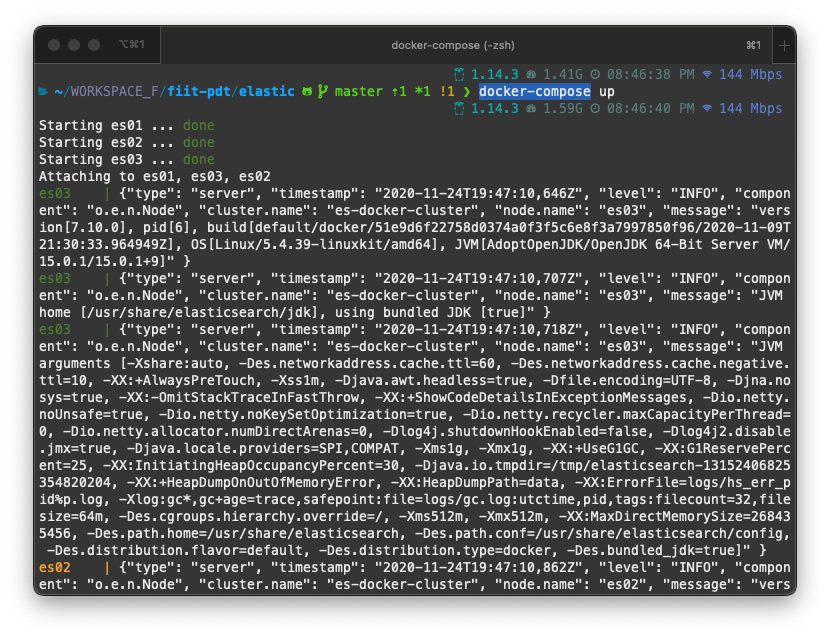

# 6. Zadanie: Elastic Search

**Timotej Zaťko**

## Do kedy?

Keďže sa preklápame do času, kde toho začína byť veľa aj z pohľadu ostatným predmetov a diplomoviek, toto aj ďalšie zadanie (obe sú Elasticsearch) bude mať spoločný čas odovzdania a to je 4.12. 23:59.

## Zadanie č.1 – práca s indexom a dokumentami v Elasticsearch

1. Rozbehajte si 3 inštancie Elasticsearch-u
2. Vytvorte index pre Tweety, ktorý bude mať “optimálny“ počet shardov a replík pre 3 nody
(aby tam bola distribúcia dotazov vo vyhľadávaní, aj distribúcia uložených dát)
3. Vytvorte mapping pre normalizované dáta z Postgresu - Tweet musí obsahovať údaje rovnaké ako máte už uložené v PostgreSQL. Dbajte na to, aby ste vytvorili polia v správnom dátovom type (polia ktoré má zmysel analyzovať analyzujte správne, tie ktoré nemá, aby neboli zbytočne analyzované (keyword analyzer)) tak aby index nebol zbytočne veľký. Mapovanie musí byť striktné.
4. Vytvorte bulk import pre vaše normalizované Tweety.
5. Importujete dáta do Elasticsearchu
6. Experimentujte s nódami, a zistite koľko nódov musí bežať (a ktoré) aby vám Elasticsearch vedel pridávať dokumenty, mazať dokumenty, prezerať dokumenty a vyhľadávať nad nimi?
7. Upravujte počet retweetov pre vami vybraný tweet pomocou vašeho jednoduchého scriptu (v rámci Elasticsearchu) a sledujte ako sa mení _seq_no a_primary_term pri tom ako zabíjate a spúšťate nódy.

### Hodnotenie

Zadanie č.1 - hodnotenie - dokopy 7,5 boda rozdelené percentuálne:

- 2 - prečo ste vytvorili index tak ako ste vytvorili? / 10%
- 3 - ako ste vytvorili mapovanie? / 25%
- 4 - naindexovali ste správny počet dokumentov (buď vaše číslo z PostgreSQL, alebo správny
počet)? / 25%
- 5 - napísali ste skript tak aby dával zmysel / 15%
- 6 + 7 napíšte v skratke aké prípady ste si definovali a prečo. Popísali ste výstupy
zmysluplne? Tj. oťukali ste si ako to funguje? / 25%

## Odpovede

### 1. Rozbehajte si 3 inštancie Elasticsearch-u

Rozbehal som.



**GET:** `http://localhost:9200/_cat/nodes`

Response:
```
172.19.0.3 45 84 48 1.84 3.31 1.70 cdhilmrstw - es01
172.19.0.4 45 84 48 1.84 3.31 1.70 cdhilmrstw - es02
172.19.0.2 48 84 48 1.84 3.31 1.70 cdhilmrstw * es03s
```

### 2. Vytvorte index pre Tweety, ktorý bude mať “optimálny“ počet shardov a replík pre 3 nody

Zvolil som 3 shardy lebo mam 3 nody.  

**PUT:** `http://localhost:9200/tweets`

Body:
```json
{
  "settings": {
    "number_of_shards": 3,
    "number_of_replicas": 2
  }
}
```

**GET:** `http://localhost:9200/_cat/shards`

Response:
```
tweets 2 r STARTED 2325451 1.3gb 172.19.0.2 es03
tweets 2 r STARTED 2325451 1.3gb 172.19.0.4 es02
tweets 2 p STARTED 2325451 1.3gb 172.19.0.3 es01
tweets 1 r STARTED 2325760 1.3gb 172.19.0.2 es03
tweets 1 p STARTED 2325760 1.3gb 172.19.0.4 es02
tweets 1 r STARTED 2325760 1.3gb 172.19.0.3 es01
tweets 0 p STARTED 2328711 1.3gb 172.19.0.2 es03
tweets 0 r STARTED 2328711 1.4gb 172.19.0.4 es02
tweets 0 r STARTED 2328711 1.3gb 172.19.0.3 es01
```
    
### 3. Vytvorte mapping pre normalizované dáta z Postgresu - Tweet musí obsahovať údaje rovnaké ako máte už uložené v PostgreSQL. Dbajte na to, aby ste vytvorili polia v správnom dátovom type (polia ktoré má zmysel analyzovať analyzujte správne, tie ktoré nemá, aby neboli zbytočne analyzované (keyword analyzer)) tak aby index nebol zbytočne veľký. Mapovanie musí byť striktné.

**PUT:** `http://localhost:9200/tweets/_mapping`

Body:
```json
{
  "dynamic": "strict",
  "properties": {
    "content": {
      "type": "text"
    },
    "location": {
      "type": "geo_point"
    },
    "retweet_count": {
      "type": "integer"
    },
    "favorite_count": {
      "type": "integer"
    },
    "happened_at": {
      "type": "date"
    },
    "author": {
      "properties": {
        "id": {
          "type": "long"
        },
        "screen_name": {
          "type": "text"
        },
        "name": {
          "type": "text"
        },
        "description": {
          "type": "text"
        },
        "followers_count": {
          "type": "integer"
        },
        "friends_count": {
          "type": "integer"
        },
        "statuses_count": {
          "type": "integer"
        }
      }
    },
    "country": {
      "properties": {
        "code": {
          "type": "keyword"
        },
        "name": {
          "type": "text"
        }
      }
    },
    "hashtags": {
      "type": "text"
    },
    "mentions": {
      "properties": {
        "id": {
          "type": "long"
        },
        "screen_name": {
          "type": "text"
        },
        "name": {
          "type": "text"
        }
      }
    },
    "parent_id": {
      "type": "keyword"
    }
  }
}
```

Response:
```json
{
    "acknowledged": true
}
```

### 4. Vytvorte bulk import pre vaše normalizované Tweety.

Bulk import sa spúšťa pomocou `make to-elastic`. Main zdrojový súbor sa nachádza v [cmd/toelastic/main.go](../cmd/toelastic/main.go).

### 5. Importujete dáta do Elasticsearchu

**GET:** `http://localhost:9200/tweets/_count`

Response:
```json
{
    "count": 6979922,
    "_shards": {
        "total": 3,
        "successful": 3,
        "skipped": 0,
        "failed": 0
    }
}
```

### 6. Experimentujte s nódami, a zistite koľko nódov musí bežať (a ktoré) aby vám Elasticsearch vedel pridávať dokumenty, mazať dokumenty, prezerať dokumenty a vyhľadávať nad nimi?

Pomocou nasledovných requestov som overoval, či funguje pridávanie, vyhľadávanie, mazanie a prezeranie.

Pridávanie - **PUT:** `http://localhost:9200/tweets/_doc/1289435277660844032`

```json
{
    "content": "RT @TechnicalGuruji: Hello guys...Giving away these Airpods Pro to you...\nStep 1 - Follow @TechnicalGuruji...\nStep 2 - Retweet this tweet..…",
    "location": null,
    "retweet_count": 34976,
    "favorite_count": 0,
    "happened_at": 1596260301,
    "author": {
        "id": 763629964763631616,
        "screen_name": "Meashishpatel",
        "name": "ashish patel",
        "description": "INDIAN🇮🇳🇮🇳🇮🇳🇮🇳 ||Student||MBA||Dreamer||2021 IAS Officer||Fan Of M.S.Dhoni ||Marval Fan ||Reader||Cheerful Mood|| The Man with Simplicity|| Beardboy ||",
        "followers_count": 348,
        "friends_count": 231,
        "statuses_count": 37
    },
    "country": null,
    "hashtags": null,
    "mentions": [
        {
            "id": 3992637442,
            "screen_name": "TechnicalGuruji",
            "name": "Gaurav Chaudhary"
        },
        {
            "id": 3992637442,
            "screen_name": "TechnicalGuruji",
            "name": "Gaurav Chaudhary"
        }
    ],
    "parent_id": "1289181743359164418"
}
```

Vyhľadávanie - **POST:** `http://localhost:9200/tweets/_search`
Body:
```json
{
   "size": 10,
   "query": {
      "match_all": {}
   }
}
```
Mazanie - **DELETE:** `http://localhost:9200/tweets/_doc/1289435277660844032`

Prezeranie - **GET:** `http://localhost:9200/tweets/_doc/1289435277660844032`


Následne som experimentoval a vypínal som nódy. Skúšal som všetky kombinácie zapnutých nódov: `es0 + es1 + es2`; `es0 + es1`; `es0 + es2`; `es1 + es2`, `es0`, `es1`, `es2`, pričom som zistil, nasledovné:

* Vyhľadávanie a prezeranie fungovalo vždy, pokiaľ bol funkčný aspoň jeden node (a bol funkčný taký node, ktorý počúval z vonka na porte 9200, tj. mohli sme tieto príkazy vykonávať)
* Mazanie a pridávanie fungovalo iba v prípade, že žije master node (a žije node, ktorý počúva na porte 9200, tj. môžeme vykonávať príkazy)
* Nemohol som robiť príkazy - HTTP requesty pokiaľ bol vypnutý node, ktorý, ako jediný počúval na porte 9200

Keď som mal jeden žijúci node (nie master), mazanie a pridávanie odpovedalo nasledovne.                              

```json
{
    "error": {
        "root_cause": [
            {
                "type": "cluster_block_exception",
                "reason": "blocked by: [SERVICE_UNAVAILABLE/2/no master];"
            }
        ],
        "type": "cluster_block_exception",
        "reason": "blocked by: [SERVICE_UNAVAILABLE/2/no master];"
    },
    "status": 503
}
```

Master node som zistil pomocou nasledovného príkazu - **GET** `http://localhost:9200/_cat/master`.  

### 7. Upravujte počet retweetov pre vami vybraný tweet pomocou vašeho jednoduchého scriptu (v rámci Elasticsearchu) a sledujte ako sa mení _seq_no a_primary_term pri tom ako zabíjate a spúšťate nódy.

Vybral som si tweet s `id` = `1289435277660844032`.

Vytvoril som nasledovný script, ktorým som zvyšoval retweet_count.

**POST:** `http://localhost:9200/tweets/_update/1289435277660844032`

Body:
```json
{
    "script": "ctx._source.retweet_count += 1"
}
```


