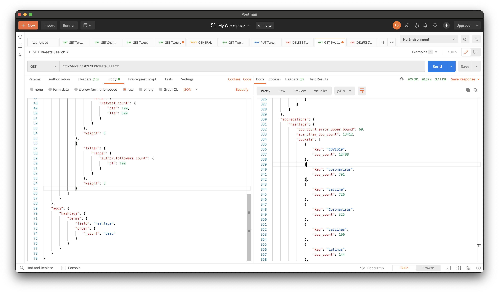
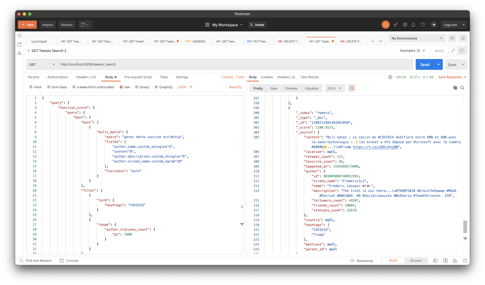
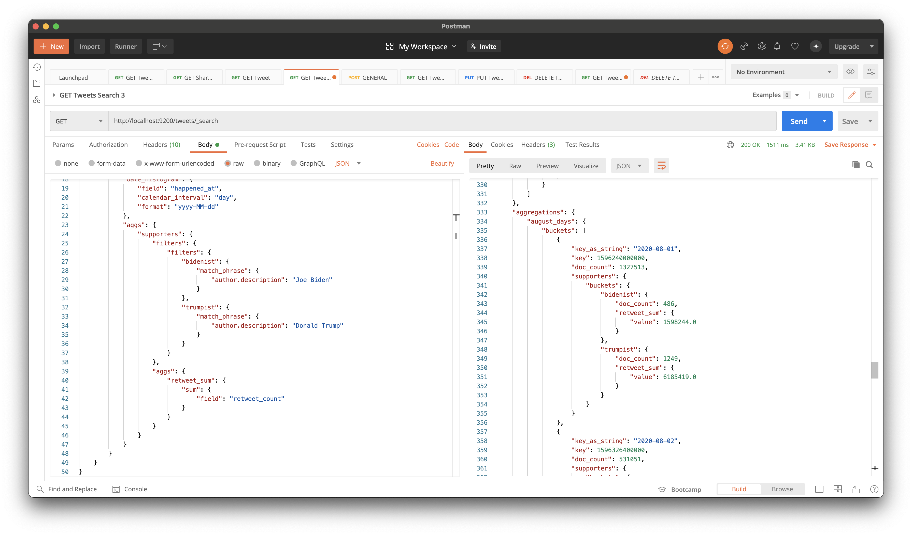
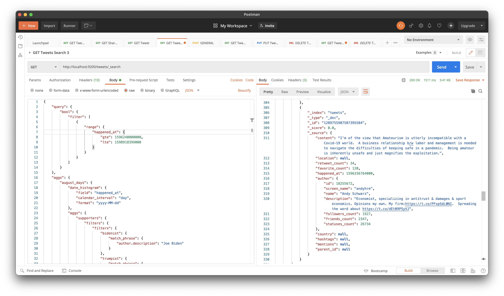

# 6. Zadanie: Elastic Search

**Timotej Zaťko**

## Zadanie:

### Časť 1. – analyzéry a mapovanie

Pre index tweets vytvorte 3 vlastné analyzéry (v settings) nasledovne:
1. Analyzér "englando". Tento analyzér bude obsahovať nasledovné: 
    1. fitre: english_possessive_stemmer, lowercase, english_stop, english_stemmer,
    1. char_filter: html_strip
    1. tokenizer: štandardný, ukážku nájdete na stránke elastic.co pre anglický analyzér
1. Analyzér custom_ngram:
    1. Filtre: lowercase, asciifolding, filter_ngrams (definujte si ho sami na rozmedzie 1-10)
    1. char_filter: html_strip
    1. tokenizer: štandardný
1. Analyzér custom_shingles:
    1. Filtre: lowercase, asciifolding, filter_shingles (definujte si ho sami a dajte token_separator: “”)
    1. char_filter: html_strip
    1. tokenizer: štandardný

Do mapovania pridajte:
1. Každý anglický text (rátajme že každý tweet a description u autora je primárne v angličtine) nech je analyzovaný novým analyzérom "englando"
1. Priraďte analýzery
    1. author.name nech má aj mapovania pre custom_ngram, a custom_shingles, 
    1. author. screen_name nech má aj custom_ngram, 
    1. author.description nech má aj custom_shingles. Toto platí aj pre mentions, ak tam tie záznamy máte.

Následne preindexujte dokumenty (ideálne cez reindex API).

### Časť 2. – vyhľadávanie

Vyhľadajte vo vašich tweetoch spojenie "gates s0ros vaccine micr0chip". V query použite function_score, kde jednotlivé medzikroky sú nasledovné:

Query:
1. Must - vyhľadajte vo viacerých poliach (konkrétne: author.name (pomocou shingle), content (cez analyzovaný anglický text), author.description (pomocou shingles), author.screen_name (pomocou ngram)) spojenie "gates s0ros vaccine micr0chip", zapojte podporu pre preklepy, operátor je OR.
1. Tieto polia vo vyhľadávaní boost-nite nasledovne - author.name * 6, content * 8, author.description * 6, author.screen_name * 10.
1. Filter - vyfiltrujte len tie, ktoré majú author.statuses_count > 1000
1. Should – boost-nite 10 krat tie, ktoré obsahujú v mentions.name (tento objekt je typu nested) cez ngram string "real".
1. Nastavte podmienené váhy cez functions nasledovne:
    1. retweet_count, ktorý je väčší rovný ako 100 a menší rovný ako 500 na 6,
    1. author.followers_count väčší ako 100 na 3

Zobrazte agregácie pre výsledky na konci. Vytvorte bucket hashtags podľa hashtagov a spočítajte hodnoty výskytov (na webe by to mohli byť facety). Následne “vyberte” ten, ktorý má najväčší počet a pridajte ho do filtra.

### Časť 3. – agregácie

Trumpovci vs Bidenovci. Pracujte zo všetkými tweetami, ktoré máte a sú vytvorené v auguste (použite tu dátumovú matematiku). Následne pre všetky augustové dni zistite pomocou vnorených agregácii, koľko retweet_count sumárne majú tweety Bidenových podporovateľov a koľko majú tweety Trumpových podporovateľov pre každý jeden deň. Podporovateľ je účet, ktorý má v account_description meno ako frázu jedného z kandidátov (“Joe Biden” a “Donald Trump”). Vo výsledku zhodnoťte kto je aktívnejší a víťaz na tejto sociálnej sieti☺.


## Vypracovanie

### Časť 1. – analyzéry a mapovanie

Pri vytváraní analyzérov musím najskôr zatvoriť index pomocou: **POST** - `http://localhost:9200/tweets-2/_close`. Potom ho môžem otvoriť pomocou: **POST** - `http://localhost:9200/tweets-2/_open` 

1. Podľa zadania vytvorím analyzér *englando*.

**PUT:** `http://localhost:9200/tweets/_settings`

Body:
```json
{
    "analysis": {
        "analyzer": {
            "englando": {
                "type": "custom",
                "filter": [
                    "english_possessive_stemmer",
                    "lowercase",
                    "english_stop",
                    "english_stemmer"
                ],
                "char_filter": [
                    "html_strip"
                ],
                "tokenizer": "standard"
            }
        },
        "filter": {
            "english_possessive_stemmer": {
                "type": "stemmer",
                "language": "possessive_english"
            },
            "english_stop": {
                "type": "stop",
                "stopwords": "_english_"
            },
            "english_stemmer": {
                "type": "stemmer",
                "language": "english"
            }
        }
    }
}
```

Response:
```json
{
    "acknowledged": true
}
```

2. Podľa zadania vytovrím analyzér *custom_ngram*.

**PUT:** `http://localhost:9200/tweets/_settings`

Body:
```json
{
    "index": {
        "max_ngram_diff": 9
    },
    "analysis": {
        "analyzer": {
            "custom_ngram": {
                "type": "custom",
                "filter": [
                    "lowercase",
                    "asciifolding",
                    "filter_ngram"
                ],
                "char_filter": [
                    "html_strip"
                ],
                "tokenizer": "standard"
            }
        },
        "filter": {
            "filter_ngram": {
                "type": "ngram",
                "min_gram": 1,
                "max_gram": 10
            }
        }
    }
}
```

Response:
```json
{
    "acknowledged": true
}
```

3. Podľa zadania vytvorím analyzér *custom_shingles*.

Body:
```json
{
    "analysis": {
        "analyzer": {
            "custom_shingles": {
                "type": "custom",
                "filter": [
                    "lowercase",
                    "asciifolding",
                    "filter_shingles"
                ],
                "char_filter": [
                    "html_strip"
                ],
                "tokenizer": "standard"
            }
        },
        "filter": {
            "filter_shingles": {
                "type": "shingle",
                "token_separator": ""
            }
        }
    }
}
```

Response:
```json
{
    "acknowledged": true
}
```

Vytvorené analyzéry použijem v mappingu, nový mapping bude vyzerať nasledovne.

```json
{
  "dynamic": "strict",
  "properties": {
    "content": {
      "type": "text",
      "analyzer": "englando"
    },
    "location": {
      "type": "geo_point"
    },
    "retweet_count": {
      "type": "integer"
    },
    "favorite_count": {
      "type": "integer"
    },
    "happened_at": {
      "type": "date"
    },
    "author": {
      "properties": {
        "id": {
          "type": "keyword"
        },
        "screen_name": {
          "type": "text",
          "fields": {
            "ngram": {
              "type": "text",
              "analyzer": "custom_ngram"
            }
          }
        },
        "name": {
          "type": "text",
          "fields": {
            "shingles": {
              "type": "text",
              "analyzer": "custom_shingles"
            },
            "ngram": {
              "type": "text",
              "analyzer": "custom_ngram"
            }
          }
        },
        "description": {
          "type": "text",
          "analyzer": "englando",
          "fields": {
            "shingles": {
              "type": "text",
              "analyzer": "custom_shingles"
            }
          }
        },
        "followers_count": {
          "type": "integer"
        },
        "friends_count": {
          "type": "integer"
        },
        "statuses_count": {
          "type": "integer"
        }
      }
    },
    "country": {
      "properties": {
        "code": {
          "type": "keyword"
        },
        "name": {
          "type": "text"
        }
      }
    },
    "hashtags": {
      "type": "keyword"
    },
    "mentions": {
      "properties": {
        "id": {
          "type": "long"
        },
        "screen_name": {
          "type": "text",
          "fields": {
            "ngram": {
              "type": "text",
              "analyzer": "custom_ngram"
            }
          }
        },
        "name": {
          "type": "text",
          "fields": {
            "shingles": {
              "type": "text",
              "analyzer": "custom_shingles"
            },
            "ngram": {
              "type": "text",
              "analyzer": "custom_ngram"
            }
          }
        }
      }
    },
    "parent_id": {
      "type": "keyword"
    }
  }
}
```

Následne som svoj index reindexoval.

### Časť 2. – vyhľadávanie

__Táto query sa nachádza v [assignments/queries/2/request.json](queries/2/request.json) a [assignments/queries/2/response.json](queries/2/response.json).__

V prvej časti mojej query vyhľadám v tweetoch slovné spojenie _"gates s0ros vaccine micr0chip"_.

```
{
    "must": [
        {
            "multi_match": {
                "query": "gates s0ros vaccine micr0chip", // slovne spojenie, ktore hladam
                "fields": [
                    "author.name.custom_shingles^6", // hladam v mene autora, robim boost * 6 
                    "content^8", // hladam v obsahu tweetu, robim boost * 8
                    "author.description.custom_shingles^6", // hladam v popise autora, robim boost * 6
                    "author.screen_name.custom_ngram^10" // hladam v mene autora, robim boost * 10
                ],
                "fuzziness": "auto"
            }
        }
    ]
 }
```

Vytvorím filter na vyfiltrovanie tweetov, ktorých autor má aspoň 1000 statusov.

```
{
    "filter": [
        {
            "range": {
                "author.statuses_count": {
                    "gt": 1000
                }
            }
        }
    ]
}
```

A boostnem _(* 10)_ tie tweety, ktoré obsahujú v mentions.name cez ngram string "real".

```
{
    "should": {
        "match": {
            "mentions.name.custom_ngram": {
                "query": "real",
                "boost": 10
            }
        }
    }
}
```

Následne nastaví podmienené váhy cez functions nasledovne:
    1. retweet_count, ktorý je väčší rovný ako 100 a menší rovný ako 500 na 6,
    1. author.followers_count väčší ako 100 na 3

```
"functions": [
    {
        "filter": {
            "range": {
                "retweet_count": {
                    "gte": 100,
                    "lte": 500
                }
            }
        },
        "weight": 6
    },
    {
        "filter": {
            "range": {
                "author.followers_count": {
                    "gt": 100
                }
            }
        },
        "weight": 3
    }
]
```

Teraz spravím záverečnú agregáciu počtu tweetov pre každý hashatg.

```
{
    "aggs": {
        "hashtags": {
            "terms": {
                "field": "hashtags",
                "order": {
                    "_count": "desc"
                }
            }
        }
    }
}
```

A ešte vyfiltrujem ten najčastejší hashtag.

```
{
    "term": {
        "hashtags": "COVID19"
    }
},
```

Takto vyzerá výsledná query.

**GET:** `http://localhost:9200/tweets/_search`

Body:
```json
{
    "query": {
        "function_score": {
            "query": {
                "bool": {
                    "must": [
                        {
                            "multi_match": {
                                "query": "gates s0ros vaccine micr0chip",
                                "fields": [
                                    "author.name.custom_shingles^6",
                                    "content^8",
                                    "author.description.custom_shingles^6",
                                    "author.screen_name.custom_ngram^10"
                                ],
                                "fuzziness": "auto"
                            }
                        }
                    ],
                    "filter": [
                        {
                            "term": {
                                "hashtags": "COVID19"
                            }
                        },
                        {
                            "range": {
                                "author.statuses_count": {
                                    "gt": 1000
                                }
                            }
                        }
                    ],
                    "should": {
                        "match": {
                            "mentions.name.custom_ngram": {
                                "query": "real",
                                "boost": 10
                            }
                        }
                    }
                }
            },
            "functions": [
                {
                    "filter": {
                        "range": {
                            "retweet_count": {
                                "gte": 100,
                                "lte": 500
                            }
                        }
                    },
                    "weight": 6
                },
                {
                    "filter": {
                        "range": {
                            "author.followers_count": {
                                "gt": 100
                            }
                        }
                    },
                    "weight": 3
                }
            ]
        }
    },
    "aggs": {
        "hashtags": {
            "terms": {
                "field": "hashtags",
                "order": {
                    "_count": "desc"
                }
            }
        }
    }
}
```




### Časť 3. – agregácie

__Táto query sa nachádza v [assignments/queries/3/request.json](queries/3/request.json) a [assignments/queries/3/response.json](queries/3/response.json).__

Na filtrovanie záznamov použijem bool filter. Spodnú hranicu nastavím na Sat, 01 Aug 2020 00:00:00 +0000 (1596240000000ms) a vrchnú hranicu na Mon, 31 Aug 2020 23:59:59 +0000 (1598918399999).
Ďalej použijem 'date_histogram' na získanie výsledkov po dňoch v auguste, calendar_interval nastavím na day.
Následne zoskupím tweety podľa autorho favorita, na Bidenistov a Trumpistov. V popise autora sa musí nachádzať slovné spojenie Doland Trump alebo Joe Biden. Použil som match_phrase.
Následne už iba urobím agregát počtu tweetov pre každú skupinu.

**GET:** `http://localhost:9200/tweets/_search`

Body:
```json
{
    "query": {
        "bool": {
            "filter": [
                {
                    "range": {
                        "happened_at": {
                            "gte": 1596240000000,
                            "lte": 1598918399999
                        }
                    }
                }
            ]
        }
    },
    "aggs": {
        "august_days": {
            "date_histogram": {
                "field": "happened_at",
                "calendar_interval": "day",
                "format": "yyyy-MM-dd"
            },
            "aggs": {
                "supporters": {
                    "filters": {
                        "filters": {
                            "bidenist": {
                                "match_phrase": {
                                    "author.description": "Joe Biden"
                                }
                            },
                            "trumpist": {
                                "match_phrase": {
                                    "author.description": "Donald Trump"
                                }
                            }
                        }
                    },
                    "aggs": {
                        "retweet_sum": {
                            "sum": {
                                "field": "retweet_count"
                            }
                        }
                    }
                }
            }
        }
    }
}
```

Podľa výsledkov môžeme vidieť, že na sociálnej sieti Twitter sú aktívnejší Trumpovci.




