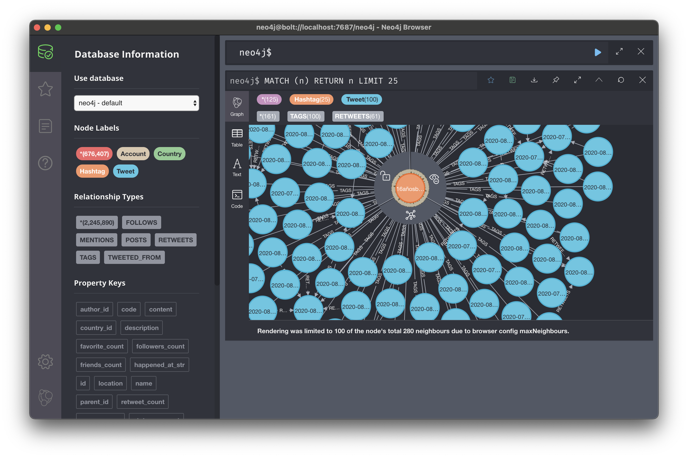
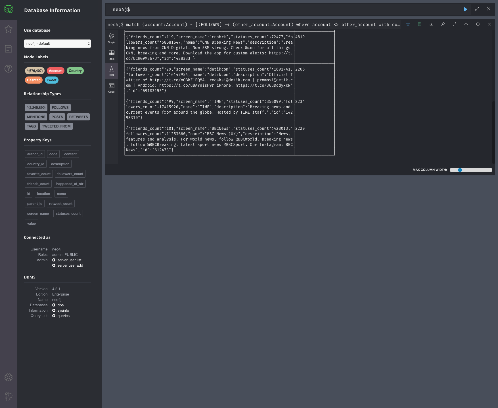
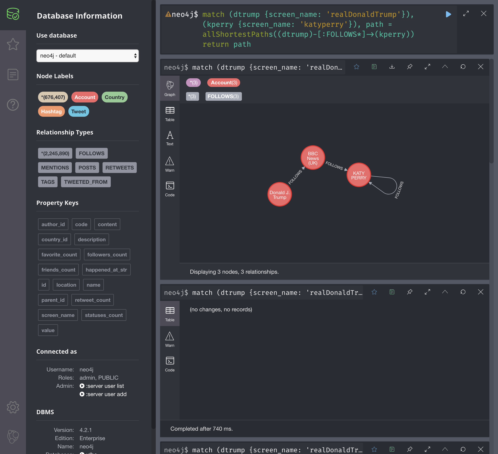
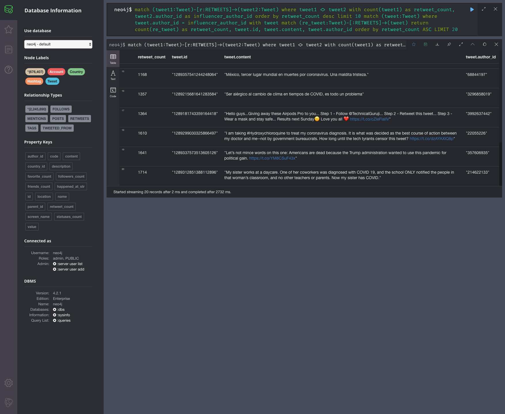
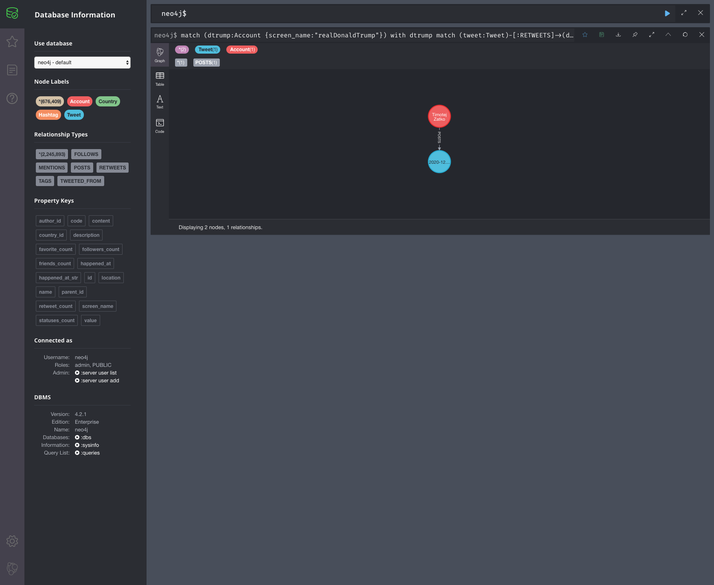
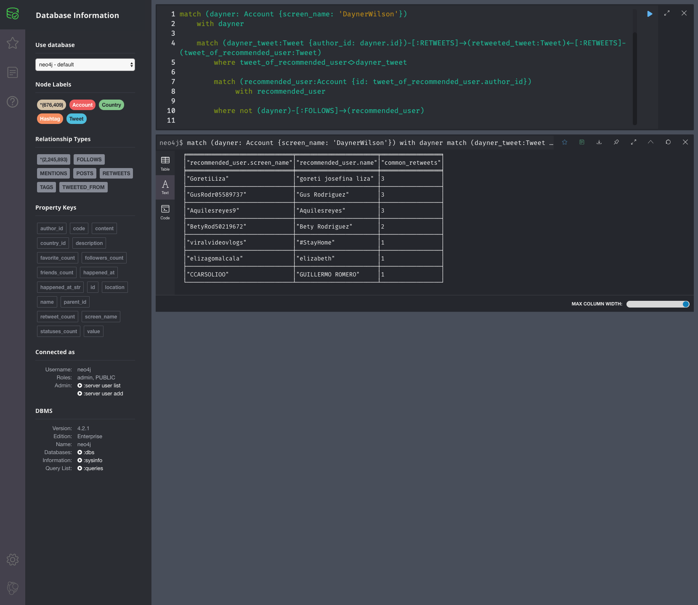
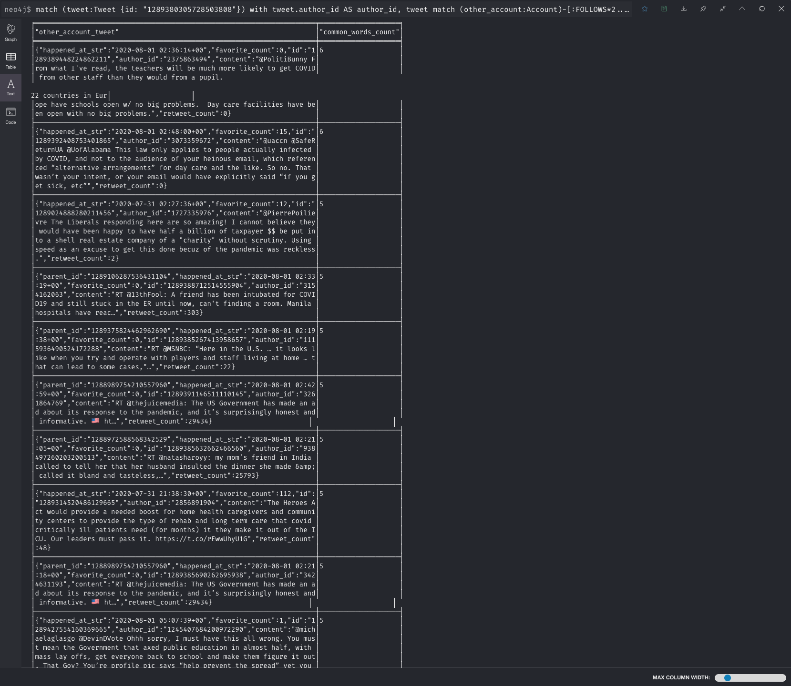
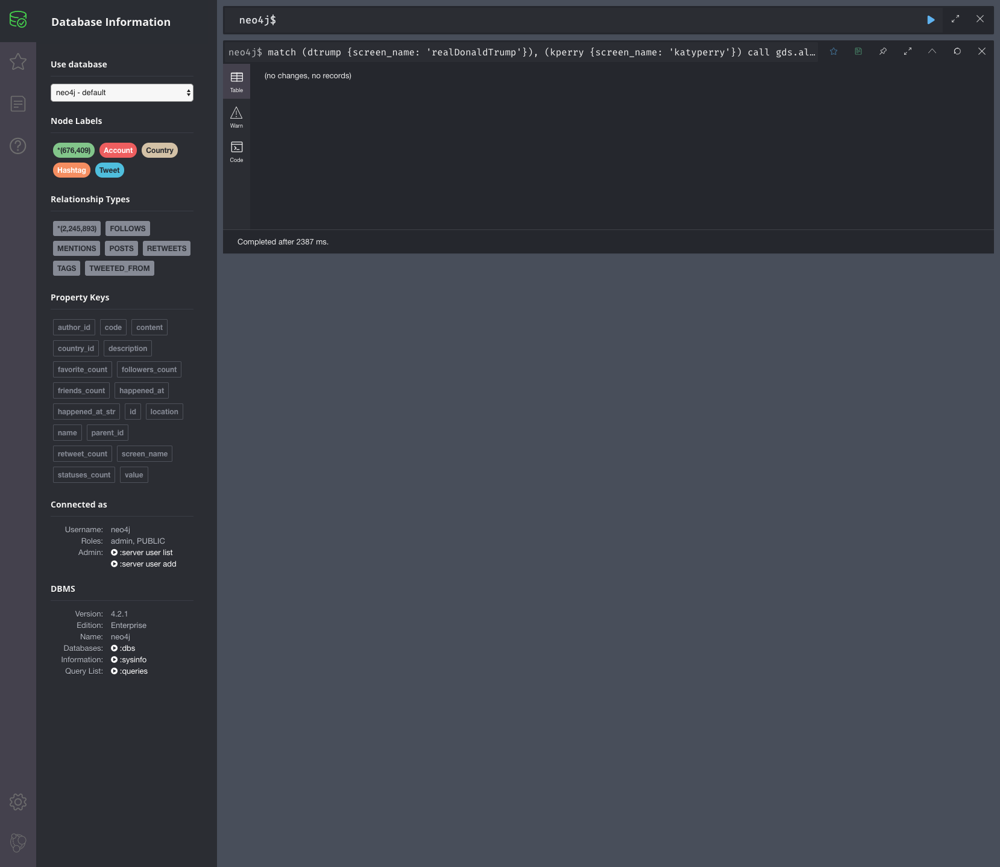
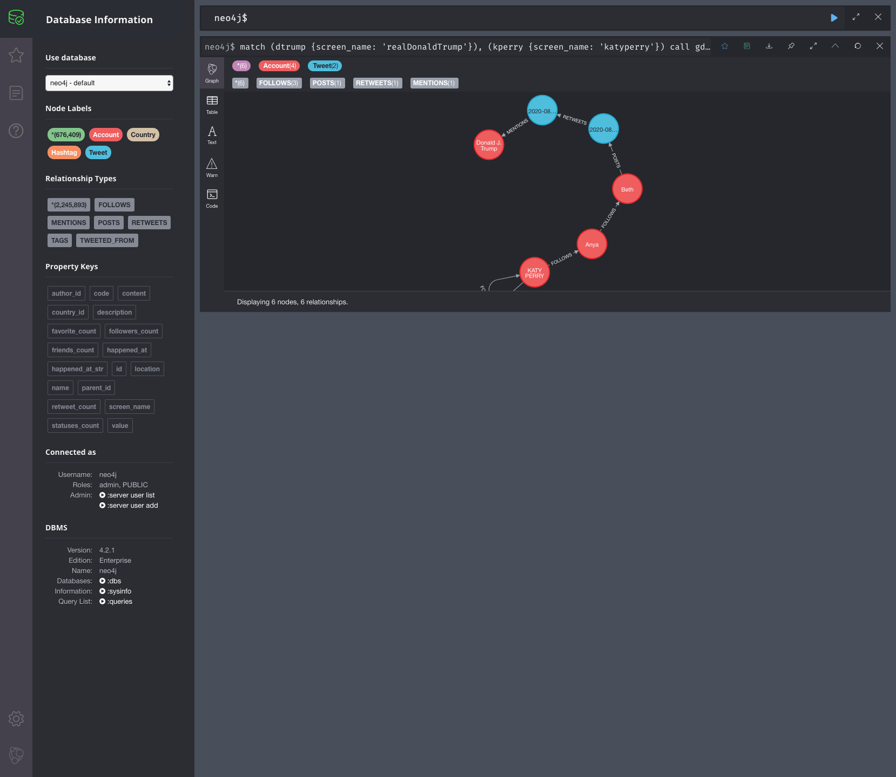

# 8. Zadanie: Neo4j

**Timotej Zaťko**

## Zadanie

### Do kedy?

Keďže všetci robíte radi s predstihom, deadline je 24.12.2020 o 19:30. A teda nech vám kapor moc nevychladne ...
Čo odovzdať?

Dotazy v separátnom textovom editore + dotaz a screenshot výsledku v pdf.

### Hodnotenie
Úlohy dokopy 10 bodov rozdelené nasledovne:
1,2,3,4,5 a 6 sú za jeden bod,
7, 8 za 2 body.
Bonusová úloha je za 3 body.

### Zadanie – Neo4j
1. Zoberte si nami vytvorený dataset z vašich tweetov: https://drive.google.com/file/d/1nyVwjhbQhT3kbMlU3mXCmJ-_uQ8Yx9B8/view?usp=sharing a importujte ho cez neo4j-admin
2. Vypíšte 10 Accountov s najvyšším množstvom followerov. Nezoraďujte Accounty podľa poľa followers_count, hodnota je prevzatá z Twitteru a nezodpovedá našim vzťahom v datasete. Zaujímajú nás followujúce Accounty v našom datasete.
3. Nájdite najkratšie cesty medzi Katy Perry {screen_name: ‘katyperry‘} a Donaldom Trumpom {screen_name: ‘realDonaldTrump‘} cez vzťah FOLLOWS. Všetky cesty, kde Donald Trump followuje niekoho, kto followuje niekoho, kto..., kto followuje Katy Perry.
4. Vyhľadajte zlyhania influencerov. Vyhľadajte 20 najmenej retweetovanych tweetov od Accountov, ktoré sú na prvých 10 miestach v celkovom počte retweetov.
5. Vytvorte volaním iba jednej query nový Account s Vašim menom, ktorý bude followovať Donalda Trumpa {screen_name:"realDonaldTrump"} a v tom istom volaní vytvorte tweet, ktorý bude retweetom Donaldovho najretweetovanejšieho tweetu.
6. Odporučte používateľovi {screen_name:"777stl"} followovanie ďalších Accountov, na základe followovania rovnakých Accountov: Vyhľadajte 10 Accountov, ktoré followujú najviac rovnakých Accountov, ale Donald ich ešte nefollowuje.
7. Odporučte používateľovi {screen_name:"DaynerWilson"} followovanie ďalších Accountov na základe zhody v retweetovaní rovnakých tweetov: Vyhľadajte 10 accountov, ktoré retweetli najviac tweetov rovnakych, ako náš používateľ. Počítajú sa aj retweety tweetov, ktoré retweetujú rovnaký tweet.
8. Vyhľadajte 10 tweetov ostatných Accountov, ktoré do hĺbky 5 followujú account, ktorý napísal tweet {id: "1289380305728503808"}, ktoré síce nie sú retweetom vybraného tweetu, ale napriek tomu majú čo najviac rovnakých slov v poli content zhodných s vybraným tweetom (odporúčam pozrieť si split() a procedúry v APOC pracujúce s collections ). Account,  ktorý followuje account, ktorý followuje nami vybraný Account rozumieme hĺbkou 2.

BONUS: Nájdite najkratšie cesty medzi Katy Perry (katyperry) a Donaldom Trumpom cez vzťah RETWEETS (a tým pádom aj POST). Všetky cesty, kde Katy Perry retweetla post Accountu, ktorý retweetol post Accountu, ktorý..., ktorý retweetol post Donalda Trumpa


## Vypracovanie

### 1. Zoberte si nami vytvorený dataset z vašich tweetov a importujte ho cez neo4j-admin

Naimportované, použil som Neo4j desktop.



### 2. Vypíšte 10 Accountov s najvyšším množstvom followerov. Nezoraďujte Accounty podľa poľa followers_count, hodnota je prevzatá z Twitteru a nezodpovedá našim vzťahom v datasete. Zaujímajú nás followujúce Accounty v našom datasete.

Query:
```
match (account:Account) - [:FOLLOWS] -> (other_account:Account)
    where account <> other_account
    with count(account) AS follower_count, other_account 
    order by follower_count desc limit 10
    return other_account, follower_count
```

Result:

```
╒══════════════════════════════════════════════════════════════════════╤════════════════╕
│"other_account"                                                       │"follower_count"│
╞══════════════════════════════════════════════════════════════════════╪════════════════╡
│{"friends_count":601062,"screen_name":"BarackObama","statuses_count":1│12725           │
│5926,"followers_count":122702797,"name":"Barack Obama","description":"│                │
│Dad, husband, President, citizen.","id":"813286"}                     │                │
├──────────────────────────────────────────────────────────────────────┼────────────────┤
│{"friends_count":224,"screen_name":"katyperry","statuses_count":10881,│11460           │
│"followers_count":108521347,"name":"KATY PERRY","description":"Love. L│                │
│ight.","id":"21447363"}                                               │                │
├──────────────────────────────────────────────────────────────────────┼────────────────┤
│{"friends_count":50,"screen_name":"realDonaldTrump","statuses_count":5│6720            │
│6081,"followers_count":86091475,"name":"Donald J. Trump","description"│                │
│:"45th President of the United States of America🇺🇸","id":"25073877"}│                │
├──────────────────────────────────────────────────────────────────────┼────────────────┤
│{"friends_count":127,"screen_name":"KimKardashian","statuses_count":33│6680            │
│006,"followers_count":66740871,"name":"Kim Kardashian West","descripti│                │
│on":"Shop @kkwfragrance Diamonds II by Kourtney x Kim x Khloé now  & @│                │
│SKIMS Sleep Naked Tuesday, 09.22 at 9AM PT","id":"25365536"}          │                │
├──────────────────────────────────────────────────────────────────────┼────────────────┤
│{"friends_count":2355,"screen_name":"narendramodi","statuses_count":27│6425            │
│625,"followers_count":62440782,"name":"Narendra Modi","description":"P│                │
│rime Minister of India","id":"18839785"}                              │                │
├──────────────────────────────────────────────────────────────────────┼────────────────┤
│{"friends_count":237,"screen_name":"BillGates","statuses_count":3382,"│5688            │
│followers_count":51941629,"name":"Bill Gates","description":"Sharing t│                │
│hings I'm learning through my foundation work and other interests.","i│                │
│d":"50393960"}                                                        │                │
├──────────────────────────────────────────────────────────────────────┼────────────────┤
│{"friends_count":119,"screen_name":"cnnbrk","statuses_count":72477,"fo│4819            │
│llowers_count":58681647,"name":"CNN Breaking News","description":"Brea│                │
│king news from CNN Digital. Now 58M strong. Check @cnn for all things │                │
│CNN, breaking and more. Download the app for custom alerts: https://t.│                │
│co/UCHG9M367J","id":"428333"}                                         │                │
├──────────────────────────────────────────────────────────────────────┼────────────────┤
│{"friends_count":29,"screen_name":"detikcom","statuses_count":1691741,│2266            │
│"followers_count":16147954,"name":"detikcom","description":"Official T│                │
│witter of https://t.co/oOBkZ1EQMA. redaksi@detik.com | promosi@detik.c│                │
│om | Android: https://t.co/uBAYnisH9r iPhone: https://t.co/36uDqdyxKN"│                │
│,"id":"69183155"}                                                     │                │
├──────────────────────────────────────────────────────────────────────┼────────────────┤
│{"friends_count":499,"screen_name":"TIME","statuses_count":356099,"fol│2234            │
│lowers_count":17415920,"name":"TIME","description":"Breaking news and │                │
│current events from around the globe. Hosted by TIME staff.","id":"142│                │
│93310"}                                                               │                │
├──────────────────────────────────────────────────────────────────────┼────────────────┤
│{"friends_count":101,"screen_name":"BBCNews","statuses_count":428013,"│2220            │
│followers_count":11253660,"name":"BBC News (UK)","description":"News, │                │
│features and analysis. For world news, follow @BBCWorld. Breaking news│                │
│, follow @BBCBreaking. Latest sport news @BBCSport. Our Instagram: BBC│                │
│News","id":"612473"}                                                  │                │
└──────────────────────────────────────────────────────────────────────┴────────────────┘
```

Screenshot:


### 3. Nájdite najkratšie cesty medzi Katy Perry {screen_name: ‘katyperry‘} a Donaldom Trumpom {screen_name: ‘realDonaldTrump‘} cez vzťah FOLLOWS. Všetky cesty, kde Donald Trump followuje niekoho, kto followuje niekoho, kto..., kto followuje Katy Perry.

Query:
```
match (dtrump {screen_name: 'realDonaldTrump'}), (kperry {screen_name: 'katyperry'}),
    path = allShortestPaths((dtrump)-[:FOLLOWS*]->(kperry))
    return path
```

Result:
```
╒══════════════════════════════════════════════════════════════════════╕
│"path"                                                                │
╞══════════════════════════════════════════════════════════════════════╡
│[{"friends_count":50,"screen_name":"realDonaldTrump","statuses_count":│
│56081,"followers_count":86091475,"name":"Donald J. Trump","description│
│":"45th President of the United States of America🇺🇸","id":"25073877"│
│},{},{"friends_count":101,"screen_name":"BBCNews","statuses_count":428│
│013,"followers_count":11253660,"name":"BBC News (UK)","description":"N│
│ews, features and analysis. For world news, follow @BBCWorld. Breaking│
│ news, follow @BBCBreaking. Latest sport news @BBCSport. Our Instagram│
│: BBCNews","id":"612473"},{"friends_count":101,"screen_name":"BBCNews"│
│,"statuses_count":428013,"followers_count":11253660,"name":"BBC News (│
│UK)","description":"News, features and analysis. For world news, follo│
│w @BBCWorld. Breaking news, follow @BBCBreaking. Latest sport news @BB│
│CSport. Our Instagram: BBCNews","id":"612473"},{},{"friends_count":224│
│,"screen_name":"katyperry","statuses_count":10881,"followers_count":10│
│8521347,"name":"KATY PERRY","description":"Love. Light.","id":"2144736│
│3"}]                                                                  │
└──────────────────────────────────────────────────────────────────────┘
```

Screenshot:


### 4. Vyhľadajte zlyhania influencerov. Vyhľadajte 20 najmenej retweetovanych tweetov od Accountov, ktoré sú na prvých 10 miestach v celkovom počte retweetov.

Túto query som rozdelil na dve časti, v prvej časti som našiel účty s najväčším počtom retweetov.

```
match (tweet1:Tweet)-[r:RETWEETS]->(tweet2:Tweet)
    where tweet1 <> tweet2 with count(tweet1) as retweet_count, tweet2.author_id as influencer_author_id
    order by retweet_count desc limit 10
```

V druhej časti som pre tieto účty našiel ich tweety, a zobral som tie, ktoré majú najmenej retweetov.

Query:
```
match (tweet1:Tweet)-[r:RETWEETS]->(tweet2:Tweet)
    where tweet1 <> tweet2 with count(tweet1) as retweet_count, tweet2.author_id as influencer_author_id
    order by retweet_count desc limit 10
match (tweet:Tweet) 
    where tweet.author_id = influencer_author_id
    with tweet match (re_tweet:Tweet)-[:RETWEETS]->(tweet)
    return count(re_tweet) as retweet_count, tweet.id, tweet.content, tweet.author_id order by retweet_count ASC LIMIT 20
```

Result:
```
╒═══════════════╤═════════════════════╤══════════════════════════════════════════════════════════════════════╤═════════════════╕
│"retweet_count"│"tweet.id"           │"tweet.content"                                                       │"tweet.author_id"│
╞═══════════════╪═════════════════════╪══════════════════════════════════════════════════════════════════════╪═════════════════╡
│1              │"1287140698131750913"│"Last night, the federal evictions moratorium expired, and rent is due│"357606935"      │
│               │                     │ next week—the same week coronavirus unemployment benefits are set to │                 │
│               │                     │end.

This is a completely preventable crisis. Congress must act immed│                 │
│               │                     │iately to extend these critical protections.

https://t.co/9gALMcbR3k"│                 │
├───────────────┼─────────────────────┼──────────────────────────────────────────────────────────────────────┼─────────────────┤
│2              │"1289243214428303360"│"Este estudio en el @washingtonpost dice que para reabrir las universi│"68844197"       │
│               │                     │dades habría que hacer una prueba de Covid cada dos días a los alumnos│                 │
│               │                     │ https://t.co/69T4wIguXG"                                             │                 │
├───────────────┼─────────────────────┼──────────────────────────────────────────────────────────────────────┼─────────────────┤
│3              │"1288554276231548929"│"Lots of #FakeNews going around about this https://t.co/OQhHYZJZvh"   │"22055226"       │
├───────────────┼─────────────────────┼──────────────────────────────────────────────────────────────────────┼─────────────────┤
│3              │"1289255470293757955"│"We know what we need to do to contain the virus and save lives and ou│"357606935"      │
│               │                     │r economy—but Republicans refuse to invest enough in widespread testin│                 │
│               │                     │g and contact tracing.

Trump and his Republican buddies don’t have wh│                 │
│               │                     │at it takes to get us out of this crisis.
https://t.co/1CDbH26bmu"    │                 │
├───────────────┼─────────────────────┼──────────────────────────────────────────────────────────────────────┼─────────────────┤
│6              │"1288962040401399815"│"Para morirse de envidia: cómo Francia está viviendo su nueva normalid│"68844197"       │
│               │                     │ad. Este articulista sale a restaurantes, va a conciertos y a centros │                 │
│               │                     │comerciales. El truco: pruebas y rastreo de contactos. https://t.co/Xc│                 │
│               │                     │VG6T7E0P"                                                             │                 │
├───────────────┼─────────────────────┼──────────────────────────────────────────────────────────────────────┼─────────────────┤
│10             │"1289287273880547328"│"We need to make sure schools have all the resources they need to dete│"357606935"      │
│               │                     │rmine whether and how to safely reopen. Anything less is recklessly en│                 │
│               │                     │dangering lives for political gain. 
https://t.co/XVwGQ7yRF4"         │                 │
├───────────────┼─────────────────────┼──────────────────────────────────────────────────────────────────────┼─────────────────┤
│12             │"1289354415372025858"│"688 fallecimientos documentados en 24 horas, ya son 46 mil 688 deceso│"68844197"       │
│               │                     │s por #Covid en #México. https://t.co/gh6x8hYCt2"                     │                 │
├───────────────┼─────────────────────┼──────────────────────────────────────────────────────────────────────┼─────────────────┤
│50             │"1289417499654541312"│"Murió Paco Valverde, un gran luchador por la naturaleza, valiente def│"68844197"       │
│               │                     │ensor de la Vaquita Marina. Hubo una enorme solidaridad para tratar de│                 │
│               │                     │ salvarlo. Gracias a todos los que estuvieron pendientes. Descanse en │                 │
│               │                     │Paz el buen pescador. Abrazo entrañable para Alan y toda su familia. h│                 │
│               │                     │ttps://t.co/4nzviIbqto"                                               │                 │
├───────────────┼─────────────────────┼──────────────────────────────────────────────────────────────────────┼─────────────────┤
│54             │"1288978547898322945"│"2. You put employees at risk for getting sick. Yes we wear a mask, bu│"2887547117"     │
│               │                     │t we are there to serve you and have families and friends we are afrai│                 │
│               │                     │d to be around now because we don’t know how long ago we came in conta│                 │
│               │                     │ct with someone or if we are infected until it’s too late."           │                 │
├───────────────┼─────────────────────┼──────────────────────────────────────────────────────────────────────┼─────────────────┤
│66             │"1288978061501722625"│"1. You put yourself at unnecessary risk of contracting covid-19. We s│"2887547117"     │
│               │                     │anitize as often as we can, but you still take your mask off to eat ar│                 │
│               │                     │ound strangers and you don’t know where they have been or who they hav│                 │
│               │                     │e been in contact with."                                              │                 │
├───────────────┼─────────────────────┼──────────────────────────────────────────────────────────────────────┼─────────────────┤
│205            │"1289279293919391749"│"So Dems and the media are fine with this I'm sure, but it's too dange│"39344374"       │
│               │                     │rous for people to vote in person or bury their loved ones? 🙄🙄🙄

“T│                 │
│               │                     │he Aug. 28 rally, organized by the Rev. Al Sharpton, aims to bring 100│                 │
│               │                     │,000 people to the nation’s capital"

https://t.co/Kti3UahfkT"        │                 │
├───────────────┼─────────────────────┼──────────────────────────────────────────────────────────────────────┼─────────────────┤
│212            │"1289299943228755971"│""Yes I do” -- Dr. Anthony Fauci says President Trump's response to th│"39344374"       │
│               │                     │e coronavirus saved lives!

https://t.co/lq5PoaMfCE"                  │                 │
├───────────────┼─────────────────────┼──────────────────────────────────────────────────────────────────────┼─────────────────┤
│228            │"1289337574977236994"│"This administration’s entire coronavirus response should be investiga│"357606935"      │
│               │                     │ted from top to bottom.

https://t.co/bQ2JphoUD5"                     │                 │
├───────────────┼─────────────────────┼──────────────────────────────────────────────────────────────────────┼─────────────────┤
│248            │"1289357330245550081"│"Con los datos de hoy México supera a Reino Unido en la cifra de falle│"68844197"       │
│               │                     │cimientos por coronavirus."                                           │                 │
├───────────────┼─────────────────────┼──────────────────────────────────────────────────────────────────────┼─────────────────┤
│1168           │"1289357541244248064"│"México, tercer lugar mundial en muertes por coronavirus. Una maldita │"68844197"       │
│               │                     │tristeza."                                                            │                 │
├───────────────┼─────────────────────┼──────────────────────────────────────────────────────────────────────┼─────────────────┤
│1357           │"1289215681641283584"│"Ser alérgico al cambio de clima en tiempos de COVID, es todo un probl│"3296858019"     │
│               │                     │ema"                                                                  │                 │
├───────────────┼─────────────────────┼──────────────────────────────────────────────────────────────────────┼─────────────────┤
│1364           │"1289181743359164418"│"Hello guys...Giving away these Airpods Pro to you...
Step 1 - Follow │"3992637442"     │
│               │                     │@TechnicalGuruji...
Step 2 - Retweet this tweet...
Step 3 - Wear a mas│                 │
│               │                     │k and stay safe...

Results next Sunday🙂
Love you all ❤️ https://t.co│                 │
│               │                     │/cZIeFlaIIV"                                                          │                 │
├───────────────┼─────────────────────┼──────────────────────────────────────────────────────────────────────┼─────────────────┤
│1610           │"1289299030325866497"│"I am taking #Hydroxychloroquine to treat my coronavirus diagnosis. It│"22055226"       │
│               │                     │ is what was decided as the best course of action between my doctor an│                 │
│               │                     │d me--not by government bureaucrats. How long until the tech tyrants c│                 │
│               │                     │ensor this tweet? https://t.co/dzAYAXiQ8p"                            │                 │
├───────────────┼─────────────────────┼──────────────────────────────────────────────────────────────────────┼─────────────────┤
│1641           │"1289337573513605126"│"Let’s not mince words on this one: Americans are dead because the Tru│"357606935"      │
│               │                     │mp administration wanted to use this pandemic for political gain. http│                 │
│               │                     │s://t.co/YM8CSuF43x"                                                  │                 │
├───────────────┼─────────────────────┼──────────────────────────────────────────────────────────────────────┼─────────────────┤
│1714           │"1289312851388112896"│"My sister works at a daycare. One of her coworkers was diagnosed with│"214622133"      │
│               │                     │ COVID 19, and the school ONLY notified the people in that woman’s cla│                 │
│               │                     │ssroom, and no other teachers or parents. Now my sister has COVID."   │                 │
└───────────────┴─────────────────────┴──────────────────────────────────────────────────────────────────────┴─────────────────┘
```

Screenshot:


### 5. Vytvorte volaním iba jednej query nový Account s Vašim menom, ktorý bude followovať Donalda Trumpa {screen_name:"realDonaldTrump"} a v tom istom volaní vytvorte tweet, ktorý bude retweetom Donaldovho najretweetovanejšieho tweetu.

Query:
```
match (dtrump:Account {screen_name:"realDonaldTrump"})
    with dtrump
    match (tweet:Tweet)-[:RETWEETS]->(dtrump_tweet:Tweet {author_id: dtrump.id})
    with count(tweet) as retweet_count, dtrump_tweet, dtrump 
    order by retweet_count desc limit 1
    
    with dtrump_tweet, dtrump
        merge (timotej:Account {id: 42, screen_name: "timotej_zatko", name: "Timotej Zatko", followers_count: 123})-[:FOLLOWS]->(dtrump)
    
        with dtrump_tweet, timotej
            merge (my_tweet:Tweet {author_id: 42, content: "Toto som retweetol omylom...", happened_at_str: "2020-12-18 11:00:00+00"})-[:RETWEETS]->(dtrump_tweet) 
            merge (timotej)-[:POSTS]->(my_tweet)      
            
            return my_tweet, timotej                    
```

Screenshot:



Zobrazím si môj nový node.

Query:
```
match (timotej:Account {screen_name:"timotej_zatko"}) return timotej
```

Screenshot:


### 6. Odporučte používateľovi {screen_name:"777stl"} followovanie ďalších Accountov, na základe followovania rovnakých Accountov: Vyhľadajte 10 Accountov, ktoré followujú najviac rovnakých Accountov, ale 777stl ich ešte nefollowuje.

Query:
```
match (recommended_user:Account)-[:FOLLOWS]->(folllowed_by_user:Account)<-[:FOLLOWS]-(user {screen_name: '777stl'})
    where not (user)-[:FOLLOWS]->(recommended_user)
    return recommended_user, count(*) as common_following
    order by common_following desc limit 10
```

Screenshot:
[](./images/031.png)

### 7. Odporučte používateľovi {screen_name:"DaynerWilson"} followovanie ďalších Accountov na základe zhody v retweetovaní rovnakých tweetov: Vyhľadajte 10 accountov, ktoré retweetli najviac tweetov rovnakych, ako náš používateľ. Počítajú sa aj retweety tweetov, ktoré retweetujú rovnaký tweet.

Najskôr som si našiel používateľa. Následne som našiel také accounty, ktoré reweetujú rovnaké tweety ako moj používateľ.
Z týchto tweetov som si vyfiltroval tweety môjho používateľa.
A z týchto tweetov som vyfiltroval tweety, ktorých autor je už mojím používateľom followovaný.
Následne som už iba spočítal počet spoločných tweetov pre každého takého používateľa.

Query:
```
match (dayner: Account {screen_name: 'DaynerWilson'})
    with dayner

    match (dayner_tweet:Tweet {author_id: dayner.id})-[:RETWEETS]->(retweeted_tweet:Tweet)<-[:RETWEETS]-(tweet_of_recommended_user:Tweet)
        where tweet_of_recommended_user<>dayner_tweet                
        
        match (recommended_user:Account {id: tweet_of_recommended_user.author_id})
             with recommended_user
             
        where not (dayner)-[:FOLLOWS]->(recommended_user)

            return recommended_user.screen_name, recommended_user.name, count(*) AS common_retweets
                order by common_retweets desc
                limit 10
```

Screenshot:


### 8. Vyhľadajte 10 tweetov ostatných Accountov, ktoré do hĺbky 5 followujú account, ktorý napísal tweet {id: "1289380305728503808"}, ktoré síce nie sú retweetom vybraného tweetu, ale napriek tomu majú čo najviac rovnakých slov v poli content zhodných s vybraným tweetom (odporúčam pozrieť si split() a procedúry v APOC pracujúce s collections ). Account,  ktorý followuje account, ktorý followuje nami vybraný Account rozumieme hĺbkou 2.

Najskôr som si našiel tweet s `id=1289380305728503808`.
Potom som si našiel accounty, ktoré do hĺbky 5 followujú autora tohto tweetu.
Z tweetov týchto accountov som vyfiltroval také tweety, ktoré nie sú retweetami pôvodného tweetu.
No a z týchto tweetov som vybral tie (10 tweetov), ktoré majú najviac spoločných slov s podobným tweetom.
Pre použitie funkcie _apoc.coll.intersection_ som si musel doinsštalovať APOC plugin.

Query:
```
match (tweet:Tweet {id: "1289380305728503808"})
    with tweet.author_id AS author_id, tweet

    match (other_account:Account)-[:FOLLOWS*2..5]->(author:Account {id: author_id})
        with other_account, tweet

        match (other_account_tweet:Tweet {author_id: other_account.id})
            where not (other_account_tweet)-[:RETWEETS]->(tweet)
                with split(other_account_tweet.content, ' ') as other_account_tweet_words, split(tweet.content, ' ') as tweet_words, other_account_tweet 

                return other_account_tweet, size(apoc.coll.intersection(other_account_tweet_words, tweet_words)) as common_words_count
                    order by common_words_count desc
                    limit 10
```


Screenshot:


### BONUS: Nájdite najkratšie cesty medzi Katy Perry (katyperry) a Donaldom Trumpom cez vzťah RETWEETS (a tým pádom aj POST). Všetky cesty, kde Katy Perry retweetla post Accountu, ktorý retweetol post Accountu, ktorý..., ktorý retweetol post Donalda Trumpa

Použil som funkciu "gds.alpha.shortestPath.stream" (musel som ju doinštalovať z _Graph Data Science Library_).
Táto funkcia použiva Dijkstrov algoritmus na hľadanie najkratšej cesty. Zadefinoval som jej ypy nodov cez ktoré môže prechádzať - Tweet a Account a 
typy vzťahov - RETWEETS, POSTS a TWEETED_FROM (ak by som nepoužil TWEETED_FROM, tak tak by bol vzťah POSTS zbytočný, pretože sa zo vzťahu RETWEETS nedostanem na usera).

Moja query avšak žiadne výsledky nenašla, tj. takáto cesta neexistuje.

Query:
```
match (dtrump {screen_name: 'realDonaldTrump'}), (kperry {screen_name: 'katyperry'})
    call gds.alpha.shortestPath.stream({
    nodeProjection: ['Tweet', 'Account'],
    relationshipProjection: ['RETWEETS', 'POSTS', 'TWEETED_FROM'],
    startNode: kperry,
    endNode: dtrump
})
yield nodeId, cost
return gds.util.asNode(nodeId), cost
```

Screenshot:


Ale, keď som doplnil vzťahy MENTIONS a FOLLOWS, našiel som najkratšiu cestu cez tieto vzťahy medzi Katy Perry a Donaldom Trumpom. :)

```
match (dtrump {screen_name: 'realDonaldTrump'}), (kperry {screen_name: 'katyperry'})
    call gds.alpha.shortestPath.stream({
    nodeProjection: ['Tweet', 'Account'],
    relationshipProjection: ['RETWEETS', 'POSTS', 'TWEETED_FROM', 'MENTIONS', 'FOLLOWS'],
    startNode: kperry,
    endNode: dtrump
})
yield nodeId, cost
return gds.util.asNode(nodeId), cost
```

Screenshot:
